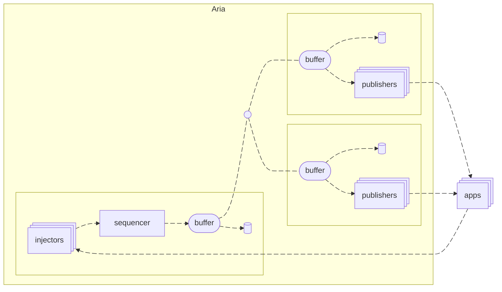

# Building a fast log

with a smidge of fault-tolerance

<!--

What do I mean by "fast", and more importantly "smidge" here?

By fast I mean double-digit microsecond append times with 10G throughput, and by
smidge I mean there are some situations we will never automatically recover from
without a human.

Hoping you take away some appreciation for the tradeoffs I'll discuss, even if
they're a bit unfashionable.

Slides are available online, link at the end

-->

---

# Hi

<!--

Jane Street
Signals and Threads
Blog post

-->

---

# A concession

<!--

I don't have an academic background, never took a distributed systems course. I
learned everything on the fly. Here's a picture of me buying a book.

- [ ] receipt

This doesn't really matter, but it's maybe useful framing, because my
experiences are lived and anecdotal.

-->

---

<v-switch>
<template #0>

# What is a log?

- data structure sequence of records
- append only

</template>
<template #1>

# What is a distributed log?

- data structure sequence of records
- append only
- can be appended to by multiple producers and read from by multiple consumers
- everyone sees all records in the same order

</template>
</v-switch>

<!-- Wedge a mention of Kafka in here somewhere? -->

---

# What is *our* distributed log?

- everything in the previous tier plus...
- filtering mechanism
- exactly-once delivery
- opt-in atomicity
- our records look like this:

  ```
  |timestamp|topic|sender|flags|payload ...|
  ```

- it's more of a platform/service, for who?

<!--

If the utility of distributed logs is not super clear, bear with me for a
minute. We're going to get there, but I think it could help to motivate the log
architecture itself first.

TODO maybe pull the "you get" and "have to read" sections out and talk about
them after

-->

---

# My favorite mental model

- all work goes in one totally-ordered log
- the records on the log represent events or updates or actions
- you have to read what you append
- state machines operate on reads
- your app is made up of different kinds of processes filtering and/or multiple
  copies of the same kind coordinating with total order or atomics
- so it's not really a request -> ack model, more of an append -> observe

<!-- Nice thing about building the app this way is that it makes recovery
     simpler. It's like multiplayer redux. -->

---

# Invested in scaling over sharding

- Total ordering means one process: a sequencer
- Sharding means giving up total ordering
- If everyone is thinking about the same log as the source of truth, we want to
  make it big

---

# Latency and throughput numbers

- Theoretically: 30us round trip times
- Practically: depends on how far away from the cluster you are
- Throughput: 10Gbps or 20Mt/s?

<!--

- [x] can I get lab to 10G?
- [ ] what about small packets?
- [ ] More realistic latency numbers when loaded? (try 1 in flight again?)

-->

---
layout: section
---

# Architecture

---

# Architecture: simple sequencer

<!--
    Diagram: injectors (many) -> sequencer -> republishers (many) -> client -> injectors

    clicks:
    1. all animated
    2. animate client -> inj (shm)
    3. repub -> client (network)
    4. animate inj -> seq -> repub
-->

- sequencer: packet in -> stamp -> packet out
- scaling through ingress (injectors) and egress (republishers)
- herd protocol over UDP w/ retransmission
- server coordination (control plane?) on the log too

<!--

Speaker notes

-->

---

# Architecture: low latency hot loop

- non-scaling because single log is processed by each node (not inherent)
- multicast + bare metal + low-latency nic + native user space networking
- multicast is optimization, still have cloud presence

<!--
Speaker notes
-->

---

# Architecture: durability

- no fsync or quorum
- rule of 2
- choose your own redundancy
- latency: disk writes out of hot loop, ring buffer + backpressure gossip

<!--
Speaker notes
-->

---

# Architecture: fault-tolerance?

- redundancy everywhere except sequencer
- consensus algorithms are easy to get wrong
- hardware is more reliable than you think
- in practice, actual downtime is very low
- but also: we're actively working on this

<!--
Speaker notes
-->

---

# Putting it all together

This is just a mermaid diagram copied from the intern talk as a test



<!--
Putting everything together, we have a bunch of boxes, with injectors on the
active sequencer box, and publishers on the others, multicast connecting them,
in-memory buffers in the the hot loop, and asynchronous disk writes.
(Backpressure is elided for visual simplicity.)
-->

---
layout: section
---

# Okay but what do you do with it

<!-- Thinking about whether htis goes before or after architecture -->

---

# A sort of paradox

- We wanted to make it really easy to use; primitives are pub/sub; component
  architecture for composition
- It is very flexible, if you know what you're doing
- But people did some very cool things with it

---

# Distributed RocksDB

- RocksDB is an embeddable persistent key-value store
- What if we published operations on the log? And applied them once we consumed?
- But if you want linearizability, you need to build that

---

# Global eventual consistency

- Write to the log in your region for fast, persistent updates
- Your region's log is relayed to a global log
- Your region's view is the global log plus the unrelayed region tail

---

# The log as a blackbox

- Time-travel interactive debugger -- with breakpoints
- Replay into the same state machine for bug or performance analysis
- Build one-off tools that use the log as a query

---

# Why not a database? / another log?

- kafka comparison w/ vertical vs horizontal
- we have historically been bad at databases
- rich update language
- cross-node coordination
- fast online synchronization (vs db for historical processing)

<!--
Speaker notes
-->

---

# These are miscellaneous notes that don't have a home

## Consensus from a single log

- like type systems eliminate a large class of bugs, same with building on aria
- still need to reason through race conditions at send time, but not receive time

## Latency and simple app design

- When your tail latency is predictable, you can design around it
- No optimistic updates, no local caching

<!--
Speaker notes
-->

---
layout: section
---

# it's over

<!--
Speaker notes
-->
