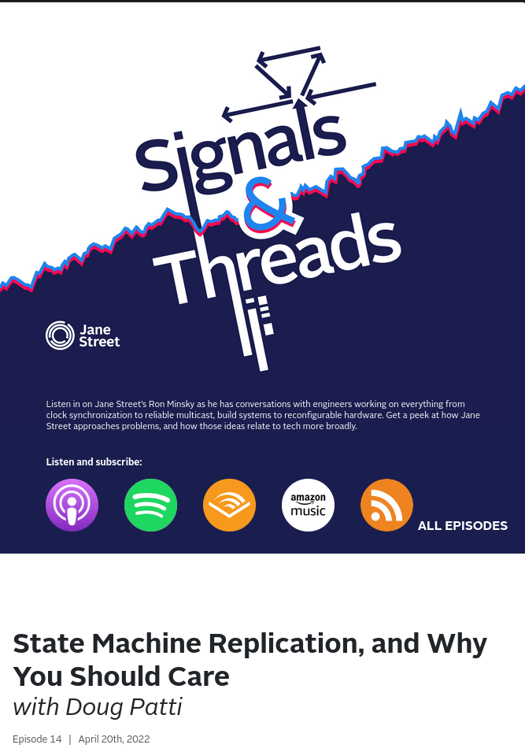
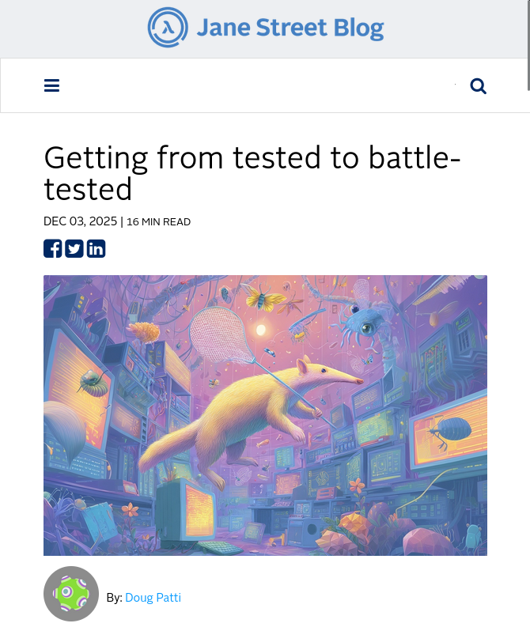
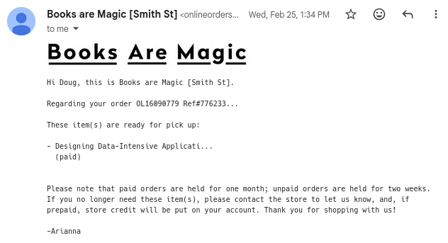
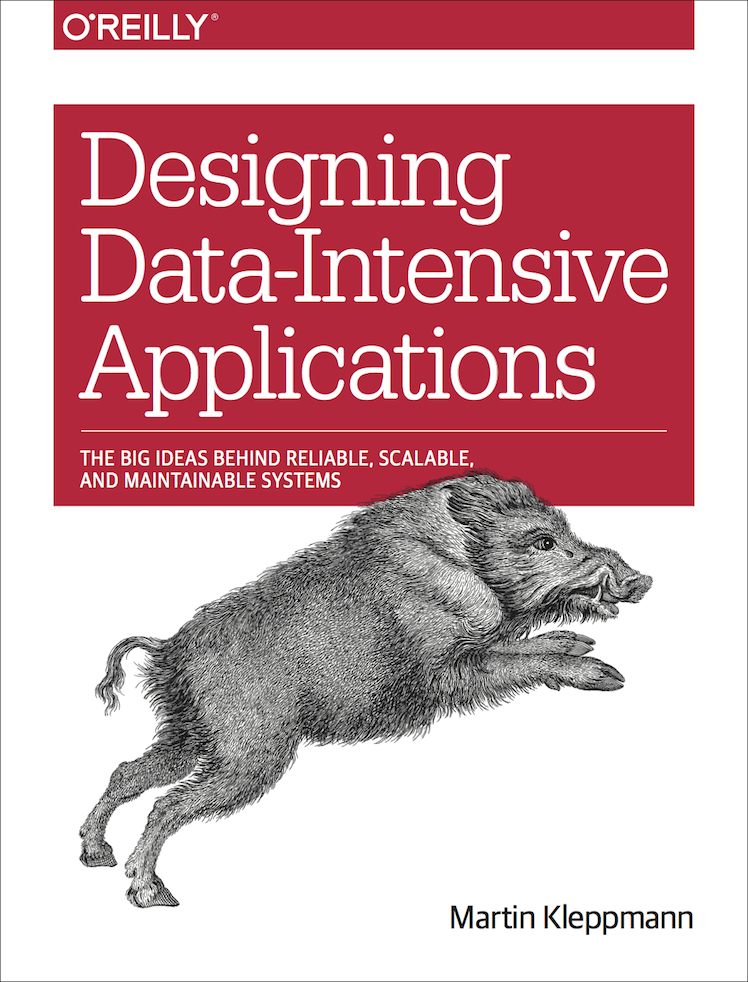

# Building a fast log

with a smidge of fault-tolerance

<!--

START THE TIMER MY DUDE

Thanks everyone for coming out. I'm here to talk about adventures in building a
fast distributed log as a platform with a smidge of fault-tolerance.

I'm going to talk about the parts that I find neat and the somewhat
unfashionable trade-offs that went into making them. To set the scene a bit by
"fast" I mean microsecond scale latencies and by "smidge" I mean there are some
conditions where everything grinds to a halt until a human intervenes.

DID YOU START THE TIMER?

-->

---
routeAlias: hi
---

# Hi

I'm Doug

<v-click>

{class="inline-block h-80 mr-8 mt-8 shadow"}
{class="inline-block h-80 mt-8 shadow"}

</v-click>

<!--

- work at Jane Street
- on a distributed log called "Aria" for the past 6ish years
- we've talked about Aria before
- Signals and Threads (SMR)
- Tech Blog (testing)
- today: weird architecture

-->

---
routeAlias: confession
---

# A confession
 <!-- otherwise the images become a subtitle -->

{v-click="", class="inline-block h-80 mr-8 mt-8 shadow"}
{v-click="", class="inline-block h-80 mt-8 shadow"}

<!--

- I'm not an expert in distributed systems
- never even took a course
- I learned a tiny part of the field on the fly at JS
- one week after agreeing to give this talk, I bought a book
- this book
- I thought I could educate myself so that I didn't sound foolish
- but I decided instead, I'm going to just share what I know with the best
  context I can
- if something sounds weird, it's probably me and not you

-->

---
routeAlias: what-is-a-log
---

# What is a log?

<LogTape class="mt-16" />

<!--

- append-only data file
- that's basically the definition
- the only mutation is append
- example: database WAL

-->

---
routeAlias: what-is-a-distributed-log
---

# What is a distributed log?

<DistributedLogTape class="mt-16" />

<!--

- it's the multiplayer version of logs
- many actors distributed all over operating together
- you can still only append
- and everyone sees the same log: all records in the same order
- this is called total ordering and it's the most important part of this talk
- Kafka is an example of a popular distributed log
- one common use-case: write events for downstream consumers
- we're going to talk about something else

-->

---
layout: center
routeAlias: obsessed
---

# Jane Street is a bit obsessed with logs

and historically allergic to databases

<!--

- Aria is not the first log abstraction we've built, nor is it the second or third
- We *do* use dbs, but for a number of reasons, they haven't been the easy choice
- (though this is changing)
- It isn't one vs the other
- Motivating logs: power in how you express change, test, introspect, debug

-->

---
routeAlias: mental-model
clicks: 11
---

# One mental model for building on a distributed log

<MentalModel />

<!--

- Example for orienting: TODO (dispatching a request? bank transer? breaking
  down work?)
- We start with a log that contains lots of records from different components in
  our service
- [click] We build a state machine, but it doesn't want every message
- [click] So we filter the log down to only the messages we want
- [click] Then we iterate, modifying our state
- [click] Now our application might want to do something, maybe due to some side
  effect
- [click] It sends a <star> message, but there's also another in flight.
  Importantly, it does not incorporate this message into its own state
- [click] The appends land in some order
- [click] You also aren't waiting for an "ack", you just keep going
- [click] You're forced to deal with the potential race condition
- [click] When you see your message, you finally process it
- [click] And occasionally, you snapshot and continue to start up from there
  next time.

- It's not request/response; it's append/observe

-->

---
layout: center
routeAlias: like-this-pattern
---

# We like this pattern

but it has limitations

<v-clicks>

- Logs are flexible
- Total ordering gives you *consensus*
- But it is inherently a bottleneck

</v-clicks>

<!--

- [click] You decide the data and how it is interpreted
- [click] Total ordering is *consensus*
    - All race conditions are settled on the log
    - All consumers can agree on the outcome without further communication
- [click] If there is exactly one order, that order must be determined by one
  thing
- (At least, I think)
- Sharding would cause you to lose total ordering
- Kafka does this

-->

---
routeAlias: aria-goal
---

# We made Aria to be a platform teams could build on

How far can we push a log that is fast, low-latency, and has total ordering?

<v-clicks>

- Speed (~30us round-trip)
- Scale (up to 10Gbps of writes per Aria instance)
- Reliability (historically good uptime, predictable performance, data retention)

</v-clicks>

<v-click>

## But a quick reality check

This isn't like, the backbone of Jane Street or something

</v-click>

<!--

- [click] This does matter to us more. But sometimes latency is bottleneck on
  throughput
- [click] There's not just "one" Aria: each region has at least one, some
  users get their own, some for cloud environments, etc.
- Also this is not nearly big data scale
- [click] Reliability: no number here, but more than just "uptime"
- [click] I don't want to give you the wrong impression. Lots of systems at JS,
  different requirements, etc.

-->

---
layout: center
routeAlias: architecture
---

# A peek into Aria

<!-- It has evolved a lot! And it will keep evolving -->

---
routeAlias: speed
clicks: 4
---

# Designing for speed

You need a sequencer, so keep it simple

<AnimatedMermaid :code="cheapAppends" :steps="[['e1'], ['e2', 'e3'], ['e4', 'e5', 'e6', 'e7'], ['e1', 'e2', 'e3', 'e4', 'e5']]" />

<!--

- single node aria
- focus on the sequencer: single point of ordering
- let's trace
- [click] client wants to append, sends to injectors - authz, rate limiting,
  chunking, etc
- [click] here's where we get our ordering. read record in, stamp, push record out
- strictly increaseing timestamp
- persistence here is a combination of an in-memory ring buffer and disk writes;
  we don't fsync on every append, and we'll come back to that
- [click] publishers filter the log and deliver to clients
- we can scale those out more easily

-->

---
routeAlias: durability
clicks: 1
---

# Designing for durability

Putting bounds on data loss

<AnimatedMermaid :frames="durabilityFrames" class="transform scale-75 origin-top" />

<!--

- this diagram is 3 aria nodes connected by a network
- notice seq B and C are disabled
- also notice publishers on the first node are too
- [click] here's the path from that same one client again
- still has two connections, but the data makes it to two nodes
- this gives us the guarantee that any single node loss will not lose data we've
  delivered to a client
- this is also why we don't block on fsync: our durability model revolves around
  two nodes having the data
- this whole scheme is still fast because we do internal replication with a UDP
  multicast protocol, bare metal servers, our own managed datacenters,
  low-latency nics, userspace networking
-->

---
routeAlias: fault-tolerance
clicks: 3
---

# Fault tolerance

And other ugly truths

<FaultTolerance />

<!--

- redundancy everywhere except sequencer
- [click] if we lose this node, clients can choose a different publisher
- [click] if we lose THIS node though...
- the system grinds to a halt
- we don't do automatic election or promotion of another sequencer
- why?? consensus algorithms are easy to get wrong
- hardware is more reliable than you think
- but in practice, actual downtime is very low - 5m for americas instance
- but also: we're actively working on this

### It's nuanced!

- we've built the system, and we've built the tooling and know-how to react in
  many different scenarios

-->

---
routeAlias: losing-writes
clicks: 3
---

# Promoting the wrong sequencer

Promoting a server that does not have the most recent message will fork the
stream.

<DataLoss class="mt-8" />

<!--

- rule of 2: the node serving clients (publishers on B) is the furthest ahead
- 4 & 5 aren't lost: clients saw them and B still has them
- but promote C (behind) and its new appends collide with B's offsets

-->

---
routeAlias: split-brain
clicks: 5
---

# Promoting two sequencers

Promoting a sequencer does not prevent another sequencer from acting, especially
in a network partition.

<SplitBrain class="mt-8" />

<!--

- two active sequencers = two truths for the same offset = corruption

-->

---
layout: section
routeAlias: usage
---

# Do we have regrets?
¯\\\_(ツ)_/¯

<!--

- Certainly some, but the redundancy story has worked out so far
- It's a looming threat for sure

- We made something really easy to use, and people like that
- We also made it capable of providing expert level control
- But people did some very cool things with it

-->

---
layout: section
routeAlias: end
---

# it's over?

<!--

Not really, I was going to talk about more things but it got long

But in all, total ordering is great and powerful especially when you can afford
it

Here's the rest of the slides, don't blink

-->

---
routeAlias: rocksdb
---

# Distributed RocksDB

- RocksDB is an embeddable persistent key-value store
- What if we published operations on the log? And applied them once we consumed?
- But if you want linearizability, you need to build that

---
routeAlias: eventual-consistency
clicks: 2
---

# Global eventual consistency

- Write to the log in your region for fast, persistent updates
- Your region's log is relayed to a global log
- Your region's view is the global log plus the unrelayed region tail

<EventualConsistency class="mt-8" />

---
routeAlias: history
---

# The log as a history

- Time-travel interactive debugger -- with breakpoints
- Replay into the same state machine for bug or performance analysis
- Build one-off tools that use the log as a query

---
layout: section
routeAlias: endend
---

# ok now it's over

<https://dpatti.com>
