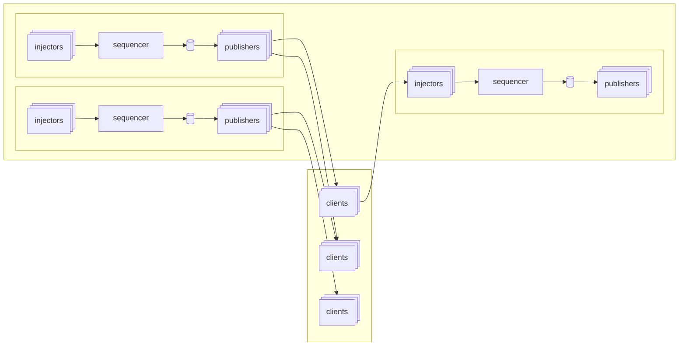

# Building a fast log

with a smidge of fault-tolerance

<!--

What do I mean by "fast", and more importantly "smidge" here?

By fast I mean double-digit microsecond append times with 10G throughput, and by
smidge I mean there are some situations we will never automatically recover from
without a human.

Hoping you take away some appreciation for the tradeoffs I'll discuss, even if
they're a bit unfashionable.

Slides are available online, link at the end

- [ ] really get intro down

-->

---
routeAlias: hi
---

# Hi

<!--

- Jane Street
- work on a distributed log called "Aria"
- Signals and Threads
- Blog post

-->

---
routeAlias: confession
---

# A confession

<!--

- [ ] why are these so tinted?

-->

<v-click>

{class="inline-block h-80 mr-8 mt-8 shadow"}
{class="inline-block h-80 mt-8 shadow"}

</v-click>

<!--

I don't have an academic background, never took a distributed systems course. I
learned everything on the fly. Here's a picture of me buying a book.

- 11 days after agreeing to this talk

This doesn't really matter, but it's maybe useful framing, because my
experiences are lived and anecdotal.

-->

---
routeAlias: what-is-a-log
---

# What is a log?

<LogTape class="mt-16" />

<!--
- append-only data file
- here we have records
- state machines / determinism built on log data
- Example: database WAL
-->

---
routeAlias: what-is-a-distributed-log
---

# What is a distributed log?

<DistributedLogTape class="mt-16" />

<!--

- it's the multiplayer version of logs
- everyone sees all records in the same order
- Kafka is example, Databases also love these (e.g., replication log)
- option: write events for downstream readers

-->

---
routeAlias: obsessed
---

# Jane Street is a bit obsessed with logs

and historically allergic to databases

<!--

- Aria is not the first (or second or third) log abstraction we've built
- We do USE dbs, but they're not the easy thing to reach for
- (though this is changing)
- The two are not incompatible!

-->

---
routeAlias: mental-model
---

# A mental model for building on a distributed log

<!-- Maybe diagram -->

1. Start with a distributed log with a total ordering
1. You build a state machine with some kind of update language
1. You subscribe to some subset of the log
1. You append updates you intend to make to the log
1. You read back all updates from your subscriptions and process them
1. You occasionally take a snapshot of your state machine along with where in
   the log it was taken

<!--

- You do not process your update at the time you send it
- You don't wait for an "ack" for an append
- You get the ability to recover quite easily, even mid-operation
- There's something really satisfying about the purity of state machines and
  your ability to reason about them
- You can build hot-hot replicas really easily
- You have a framework for thinking about race conditions

> Ordering is consensus. All race conditions are settled with the log. e.g.,
> two people buying tickets for a concert - who wins? whoever came first on the
> log. and importantly, all nodes in the system can agree on that.

Downsides:

- You still have to deal with I/O
- ...

-->

---
routeAlias: dreams-and-reality
---

# Dreams and reality

## Total ordering is great

- Useful foundation to build simple and complex apps alike

## Total ordering is hard

- The easiest way to scale is to shard, and when you do that, you give up total
  ordering (kinda)

- It's easier to build on fast and responsive logs

- The utility goes down the more you have to compromise

<!--

- [ ] Total ordering means one process: a sequencer
- [ ] "maximize total ordering"
- If everyone is thinking about the same log as the source of truth, we want to
  make it big

-->

---
routeAlias: aria-goal
---

# We made Aria to be generally useful

How far can we push fast, low-latency total ordering without sharding?

1. Speed
1. Scale
1. Reliability
1. Suitable for us

## Latency and throughput numbers

- Theoretically: 30us round trip times
- Practically: depends on how far away from the cluster you are
- Throughput: 10Gbps or ~20M appends/s

## But a quick reality check

This isn't like, the backbone of Jane Street or something

<!--

Reliable: availability, latency (tails), durability

latency: kind of low because it's JS

But also: there's not just "one" Aria: each region has at least one, some
special use-cases get one, some in trading datacenters, some in the cloud

-->

---
routeAlias: architecting-for-speed
clicks: 5
---

# Architecting for speed

You need a sequencer, so keep it simple

<AnimatedMermaid :code="cheapAppends" :steps="[['e1'], ['e2'], ['e3', 'e4'], ['e5', 'e6', 'e7'], ['e1', 'e2', 'e3', 'e4', 'e5']]" />

<v-switch>
<template #0>

TODO: intro — the shape of a single Aria cluster

</template>
<template #1>

TODO: step 1 — clients send appends to the injectors

</template>
<template #2>

TODO: step 2 — injectors hand off to the sequencer

</template>
<template #3>

TODO: step 3 — sequencer stamps and persists to disk

</template>
<template #4>

TODO: step 4 — publishers fan out to clients

</template>
<template #5>

TODO: step 5 — the full append loop

</template>
</v-switch>

<!--

- sequencer simple; push complication out
- scaling through ingress (injectors) and egress (publishers)
- [ ] "stamp with a timestamp" -> ??
- (?) server coordination (control plane?) on the log too

- [ ] fill out click footers above?
- [ ] use click notes below

[click:2] 2

[click] 3

- [ ] talk about bare metal, userspace networking, specialized nics

I can't tell if latency should be its own section after this, or just talked
about between these two, or after the next one (since it introduces the extra
hop).

-->

---
routeAlias: architecting-for-durability
---

# Architecting for durability

Putting bounds on data loss

<!--

- [ ] needs clicks
- [ ] herd / multicast to keep strain off sequencer/network
- rule of 2
- latency: disk writes out of hot loop, ring buffer + backpressure gossip
- non-scaling because single log is processed by each node (not inherent)
- multicast + bare metal + low-latency nic + native user space networking
- multicast is optimization, still have cloud presence
- [ ] latency here?

-->

---
routeAlias: fault-tolerance
---

# Fault tolerance

And the uglier truths

<!--

- redundancy everywhere except sequencer
- consensus algorithms are easy to get wrong
- hardware is more reliable than you think
- in practice, actual downtime is very low
- but also: we're actively working on this

- [ ] failure mode for >1 node loss
    - no quorum
    - datacenter loss
    - "press the button" is a bit reductive
        - "built the thing ourselves" tie-in
    - JS uptime requirements are different
    - good correlation between developer availability and uptime value
    - choose your own redundancy
- [ ] actual downtime numbers

-->

---
layout: section
routeAlias: drawbacks
---

# Bottlenecks

<!--

- [ ] bottlenecks: sequencer, but also full fleet

-->

---
layout: section
routeAlias: usage
---

# All this for state machine replication

<!-- Thinking about whether htis goes before or after architecture -->

---
routeAlias: paradox
---

# A sort of paradox

- We wanted to make it really easy to use; primitives are pub/sub; component
  architecture for composition
- It is very flexible, if you know what you're doing
- But people did some very cool things with it

---
routeAlias: rocksdb
---

# Distributed RocksDB

- RocksDB is an embeddable persistent key-value store
- What if we published operations on the log? And applied them once we consumed?
- But if you want linearizability, you need to build that

---
routeAlias: eventual-consistency
---

# Global eventual consistency

- Write to the log in your region for fast, persistent updates
- Your region's log is relayed to a global log
- Your region's view is the global log plus the unrelayed region tail

---
routeAlias: blackbox
---

# The log as a history

- Time-travel interactive debugger -- with breakpoints
- Replay into the same state machine for bug or performance analysis
- Build one-off tools that use the log as a query

<!-- Might cut this -->

---
layout: section
routeAlias: end
---

# it's over

---

<!--

# These are miscellaneous notes that don't have a home

## Consensus from a single log

- like type systems eliminate a large class of bugs, same with building on aria
- still need to reason through race conditions at send time, but not receive time

## Latency and simple app design

- When your tail latency is predictable, you can design around it
- No optimistic updates, no local caching

-->
